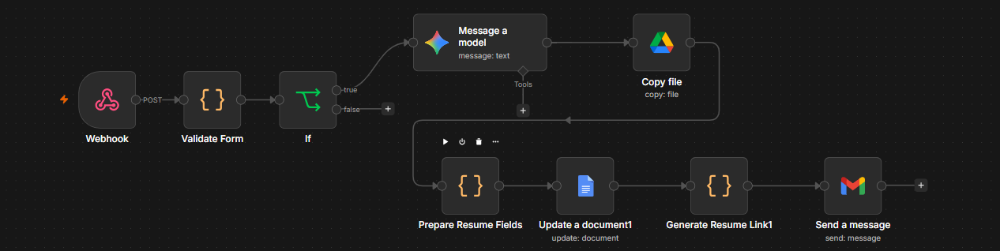

# AI Resume Builder

An AI-powered resume builder that generates professional resumes using Google Gemini and n8n automation.

## n8n Automation Workflow

The complete resume generation process is automated using n8n.

## Features

- Custom resume builder form
- Form validation
- Multiple resume types
- AI-generated resume content
- Google Docs resume generation
- Automated resume link generation
- Gmail resume delivery
- Professional resume template

## Workflow

Form
↓
n8n Webhook
↓
Form Validation
↓
Google Gemini
↓
Google Drive Template Copy
↓
Resume Field Preparation
↓
Google Docs Update
↓
Resume Link Generation
↓
Gmail

## Technologies

- HTML
- CSS
- JavaScript
- n8n
- Google Gemini
- Google Drive
- Google Docs
- Gmail

## Setup

1. Download the project.
2. Open the HTML frontend.
3. Import `n8n-workflow.json` into n8n.
4. Configure Google and Gemini credentials.
5. Update the n8n webhook URL in `index.html`.
6. Activate the workflow.
7. Open the frontend and generate a resume.

## Project Demo

Live Demo: ADD_YOUR_LIVE_LINK_HERE
